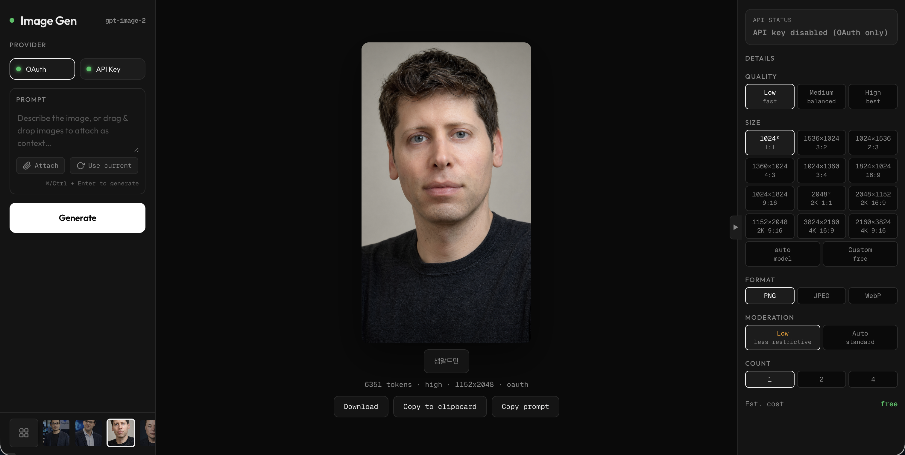

# ima2-gen

[](https://www.npmjs.com/package/ima2-gen)
[](https://nodejs.org/)
[](LICENSE)

> **Read in other languages**: [한국어](docs/README.ko.md) · [日本語](docs/README.ja.md) · [简体中文](docs/README.zh-CN.md)

Minimal CLI + web UI for OpenAI image generation. OAuth (free via ChatGPT Plus/Pro) or API key. Parallel generation, multi-image references, CLI automation, persistent history.

Current OAuth mode uses the Responses API with `gpt-5.5` plus the hosted `image_generation` tool. OpenAI's docs indicate that GPT Image models such as `gpt-image-2` can be used behind that tool, but `gpt-image-2` is not a valid `model` value for the Responses API, and the local OAuth proxy used by this app does not expose `/v1/images/generations` for direct model pinning.



---

## Quick Start

```bash
# Run instantly with npx (no install)
npx ima2-gen serve

# Or install globally
npm install -g ima2-gen
ima2 serve
```

First run prompts you to pick an auth method:

```
  Choose authentication method:
    1) API Key  — paste your OpenAI API key (paid)
    2) OAuth    — login with ChatGPT account (free)
```

Web UI opens at `http://localhost:3333`.

---

## Features

Everything in the screenshot above, shipping today:

### Authentication
- **OAuth** — log in with your ChatGPT Plus/Pro account, $0 per image
- **API Key** — paste your `sk-...` key, pay per call

Both indicators shown live in the left panel (green dot = ready, red dot = disabled). API key path is hard-disabled by default; OAuth is the primary route.

### Generation controls
| Control | Options |
|---------|---------|
| **Quality** | Low (fast) · Medium (balanced) · High (best) |
| **Size** | `1024²` `1536×1024` `1024×1536` `1360×1024` `1024×1360` `1824×1024` `1024×1824` `2048²` `2048×1152` `1152×2048` `3824×2160` `2160×3824` · `auto` · custom |
| **Format** | PNG · JPEG · WebP |
| **Moderation** | Auto (standard filter) · Low (relaxed filter) |
| **Count** | 1 · 2 · 4 parallel |

All preset sizes follow the current GPT Image sizing constraints: every side is a multiple of 16, long:short ratio ≤ 3:1, 655,360–8,294,400 total pixels.

### Workflow
- **Multi-reference** — attach up to 5 reference images, drag & drop anywhere on the left panel
- **Prompt-with-context** — mixes text + reference images in one request
- **Use current** — one-click re-use of the selected image as a new reference
- **Download** · **Copy to clipboard** · **Copy prompt** directly from the canvas
- **Sticky gallery strip** at the bottom, fixed-position so it never scrolls away
- **Gallery modal (+)** — grid view of everything in history
- **Session persistence** — refresh mid-generation and your pending jobs reconcile automatically

### CLI (headless automation)
```bash
ima2 gen "a shiba in space" -q high -o shiba.png
ima2 gen "merge these" --ref a.png --ref b.png -n 4 -d out/
ima2 ls -n 10
ima2 ps
ima2 ping
```

Full command matrix below ↓

---

## CLI Commands

### Server commands
| Command | Alias | Description |
|---------|-------|-------------|
| `ima2 serve` | — | Start the web server (auto-setup on first run) |
| `ima2 setup` | `login` | Reconfigure authentication method |
| `ima2 status` | — | Show current config & auth status |
| `ima2 doctor` | — | Diagnose environment & dependencies |
| `ima2 open` | — | Open web UI in browser |
| `ima2 reset` | — | Clear saved configuration |
| `ima2 --version` | `-v` | Show version |
| `ima2 --help` | `-h` | Show help |

### Client commands (require a running `ima2 serve`)
| Command | Description |
|---------|-------------|
| `ima2 gen <prompt>` | Generate image(s) from the CLI |
| `ima2 edit <file>` | Edit an existing image (requires `--prompt`) |
| `ima2 ls` | List recent history (table or `--json`) |
| `ima2 show <name>` | Reveal one history item (`--reveal`) |
| `ima2 ps` | List active jobs (`--kind`, `--session`) |
| `ima2 ping` | Health-check the running server |

The running server advertises itself at `~/.ima2/server.json`. Client commands auto-discover it; override with `--server <url>` or `IMA2_SERVER=...`.

### Exit codes
`0` ok · `2` bad args · `3` server unreachable · `4` APIKEY_DISABLED · `5` 4xx · `6` 5xx · `7` safety refusal · `8` timeout.

---

## Roadmap

Public roadmap — subject to change. Version numbers reflect the actual ship cycle, not time estimates.

### ✅ Shipped
- **0.06** Session DB — SQLite-backed history with sidecar JSON
- **0.07** Multi-reference — up to 5 attachments, i2i merged into unified flow
- **0.08** Inflight tracking — refresh-safe pending state, phase tracking
- **0.09** Node mode — graph-based canvas for branching generations (productized in Phase 4.2: SSE partial streaming, batch selection, node-local refs, subtree duplicate)
- **0.09.1** CLI integration — `gen / edit / ls / show / ps / ping` + `/api/health` + port advertisement

### 🚧 0.10 — Compare & Reuse (current cycle)
- **F3 Prompt presets** — save/apply `{prompt, refs, quality, size}` bundles
- **F3 Gallery groupBy** — `preset / date / compareRun` grouping
- **F2 Batch A/B compare** — spawn 2–6 parallel variants from one prompt, keyboard-driven judging (`1-6`, `Space`=winner, `V`=variation, `P`=save preset)
- **F4 Export bundle** — zip selected images with `manifest.json` + per-image prompt `.txt`
- Every server verb ships with its CLI mirror (`ima2 preset / compare / export`)

### 🔭 0.11 — Card-news mode
- Instagram carousel generation (4 / 6 / 10 cards)
- Style consistency via `file_id` fan-out (not `previous_response_id`, not seed)
- Parallel card regeneration without breaking the style chain

### 🔭 0.12 — Style kit
- Codified house-style presets with style-reference uploads
- Optional `input_fidelity: "high"` for identity-critical edits

### 🗂 Backlog
- Web UI dark/light toggle
- Keyboard shortcuts cheat-sheet overlay
- Collaborative sessions (shared SQLite over WebSocket)
- Plugin system for custom post-processing

---

## Architecture

```
ima2 serve
  ├── Express server (:3333)
  │   ├── GET  /api/health         — version, uptime, activeJobs, pid
  │   ├── GET  /api/providers      — available auth methods
  │   ├── GET  /api/oauth/status   — OAuth proxy health check
  │   ├── POST /api/generate       — text+ref → image (parallel via n)
  │   ├── POST /api/edit           — ref-heavy edit path
  │   ├── GET  /api/history        — paginated sidecar listing
  │   ├── GET  /api/inflight       — in-progress jobs (kind/session filters)
  │   ├── GET  /api/sessions/*     — node-graph sessions
  │   ├── POST /api/node/generate  — node-mode generation (SSE partial images on `Accept: text/event-stream`)
  │   ├── GET  /api/billing        — API credit / cost info
  │   └── Static files (public/)   — web UI
  │
  ├── openai-oauth proxy (:10531)  — embedded OAuth relay
  └── ~/.ima2/server.json          — port advertisement for CLI auto-discovery
```

**Node mode** is enabled by default in packaged builds. To hide the mode tab in a release, build with `VITE_IMA2_NODE_MODE=0`.

---

## Configuration

Config lives in `.ima2/config.json` (auto-created, gitignored).

### Environment Variables
| Variable | Default | Description |
|----------|---------|-------------|
| `OPENAI_API_KEY` | — | OpenAI API key (skips OAuth) |
| `PORT` | `3333` | Web server port |
| `OAUTH_PORT` | `10531` | OAuth proxy port |
| `IMA2_SERVER` | — | Client: override target server URL |

```bash
cp .env.example .env
```

---

## API Pricing (API Key mode only)

| Quality | 1024×1024 | 1024×1536 | 1536×1024 | 2048×2048 | 3840×2160 |
|---------|-----------|-----------|-----------|-----------|-----------|
| Low     | $0.006    | $0.005    | $0.005    | $0.012    | $0.023    |
| Medium  | $0.053    | $0.041    | $0.041    | $0.106    | $0.200    |
| High    | $0.211    | $0.165    | $0.165    | $0.422    | $0.800    |

**OAuth mode is free** — billed against your existing ChatGPT Plus/Pro plan.

---

## Development

```bash
git clone https://github.com/lidge-jun/ima2-gen.git
cd ima2-gen
npm install
npm run dev    # server with --watch + Node mode enabled
npm test       # 51+ tests (health, CLI lib, commands, server)
```

Frontend stack:
- Vanilla HTML/CSS/JS (no framework in the published build)
- Vite + React for the Node-mode canvas (default-on, opt-out via `VITE_IMA2_NODE_MODE=0`)
- Fonts: Outfit + Geist Mono

## Tech Stack
- **Runtime**: Node.js ≥18
- **Server**: Express 5, SQLite (better-sqlite3)
- **API**: OpenAI SDK v5
- **OAuth**: `openai-oauth` proxy
- **Tests**: Node built-in test runner

---

## Troubleshooting

**Port already in use / "why is it on 3457?"**
→ The default is `3333`. If `PORT` is set in your shell (e.g. inherited from another server like `cli-jaw`), ima2 uses that instead. Unset it or run `PORT=3333 ima2 serve`.

**`ima2 ping` says server unreachable**
→ Is `ima2 serve` running? Check `~/.ima2/server.json`. Override with `ima2 ping --server http://localhost:3333`.

**OAuth login not working**
→ Run `npx @openai/codex login` manually, then `ima2 serve`.

**`ima2 doctor` fails on node_modules**
→ `npm install`.

**Images not generating**
→ `ima2 status` to verify config. API key must start with `sk-`.

---

## Release

```bash
npm run release:patch   # 1.0.2 → 1.0.3
npm run release:minor   # 1.0.x → 1.1.0
npm run release:major   # 1.x.x → 2.0.0
```

## License

MIT
