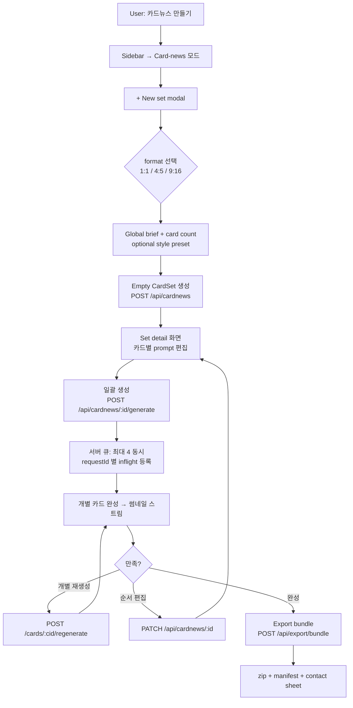

# 0.10 — Feature Expansion

Status: draft
Owner: shared FE (React 19 + Zustand) / BE (Express + SQLite)
Scope: introduce reusable creation assets (presets, batch compare, card-news, export bundle) on top of the Classic + Node foundation delivered in 0.07–0.09.
작성일: 2026-04-22

---

## 1. Context

### 1.1 What 0.07 / 0.08 / 0.09 already deliver
- **0.07 UX Chrome Refactor** — Classic mode 확정: multi-reference (최대 5장) + fixed bottom `HistoryStrip` + center `GalleryModal` + 1024-min size presets + API Status dot (`ui/src/components/{Sidebar,HistoryStrip,GalleryModal,PromptComposer,SizePicker}.tsx`). ModeTabs/i2i 경로는 제거됨.
- **0.08 In-flight + a11y** — `requestId` echo + `GET /api/inflight` + cross-tab localStorage sync + 180s TTL + `InFlightList` 컴포넌트 (`lib/inflight.js`, `ui/src/components/InFlightList.tsx`). History 는 `/api/history` (disk + sidecar) 가 유일한 source of truth.
- **0.09 Node Expansion** (in progress, Backend employee 주도) — Node mode를 1급으로: `POST /api/node/generate`가 `requestId`/`pendingRequestId` 를 수용, session graph hydration, history→graph **promotion** (one-way), 0.06 세션 호환 유지. 관련 파일: `lib/sessionStore.js`, `lib/nodeStore.js`, `ui/src/components/{NodeCanvas,ImageNode,SessionPicker}.tsx`, `ui/src/store/useAppStore.ts:411-989`.

### 1.2 Current server surface (as of HEAD)
| Category | Route | Notes |
|---|---|---|
| status | `GET /api/providers`, `GET /api/oauth/status`, `GET /api/inflight` | OAuth-only (API key disabled) |
| classic | `POST /api/generate`, `POST /api/edit` | 최대 n=8 병렬, refs≤5 |
| history | `GET /api/history` | 디스크 + `*.json` sidecar |
| node | `POST /api/node/generate`, `GET /api/node/:nodeId` | 0.09에서 `requestId` 필드 추가 |
| session | `GET/POST/PATCH/DELETE /api/sessions*`, `PUT /api/sessions/:id/graph` | graph snapshot |
| billing | `GET /api/billing` | OAuth 모드는 free |

### 1.3 What 0.10 adds (one-sentence pitch)
> 개별 이미지 생성기 → **"재사용 가능한 생성 워크벤치"**. 프롬프트·비교실험·세트·내보내기를 1급 개체로 승격한다.

### 1.4 Key constraints carried into 0.10
- OAuth-only (API key provider는 계속 비활성). 비용 보호 UI가 "과금 경고"가 아니라 "rate-limit / IPM 경고" 톤이어야 함.
- localStorage는 draft/selection/panel state만 담고, 세트·compare run·preset 본체는 **서버 SQLite** 로 이동 (0.09에서 `lib/db.js`, `sessionStore.js` 패턴 이미 확립).
- Node mode와 Classic mode는 별도 UX 트리로 유지. 0.10 신규 기능은 **Classic 우선**, Node는 read-only 연결(promotion)만 허용.

---

## 2. Priority Matrix

### 2.1 2×2 (Value × Cost)

```
                      LOW COST                         HIGH COST
HIGH   ┌───────────────────────────────┬──────────────────────────────────┐
VALUE  │ F3 Prompt presets + history   │ F1 Card-news mode                │
       │  (must-have, 0.10)            │  (0.11 — F4 dependency)          │
       ├───────────────────────────────┼──────────────────────────────────┤
       │ F2 Batch A/B compare          │ F4 Export bundle                 │
       │  (must-have, 0.10)            │  (0.11 — unblocks F1 finish)     │
LOW    └───────────────────────────────┴──────────────────────────────────┘
VALUE
                                       │ F5 Style kit (0.12, nice-to-have) │
```

### 2.2 Scored table

| ID | Feature | User value | Cost | Depends on 0.08/0.09 | Target cycle |
|---|---|---:|---:|---|---|
| F3 | Prompt presets + history | 5 | 2 | 0.09 `PromptComposer` 안정화에만 살짝 의존 | **0.10 P1** |
| F2 | Batch A/B compare grid | 5 | 3 | 0.08 `requestId`/inflight 재사용 | **0.10 P1** |
| F4 | Export bundle (zip + manifest) | 4 | 3 | `/api/history` sidecar 모델 재사용 | 0.11 |
| F1 | Card-news mode | 5 | 5 | F4 (manifest) + F3 (per-card preset) 선행 필요 | 0.11 |
| F5 | Style kit (moodboard-lite) | 3 | 3 | F3 모델 확장 | 0.12 |

→ **0.10 must-ship = {F3, F2 MVP}.** 나머지는 0.10 문서로 예고만.

---

## 3. Feature Specs

### F1. Card-news mode

**Goal**: 한 번의 기획으로 4–10장 "카드뉴스 세트"를 생성·재생성·정렬·내보내기까지 하나의 작업면에서 수행.

**Why now**: 한국어 유저 활용도 #1. 현재는 낱장 생성 후 수작업 Canva/Figma로 이어지므로 제품 이탈이 발생.

**UX flow (0.11 target)**
- Sidebar mode switch: `Classic | Node | Card-news`
- Entry: `+ New set` → modal (format / card count / global brief / style preset)
- Set detail layout: **left = card list (reorder dnd), center = focused card, right = set meta + export**
- Per-card: `Regenerate`, `Duplicate`, `Use previous as reference`, `Lock` (pinning은 일괄 재생성에서 제외)
- Cover card는 별도 aspect (1:1 or 4:5) 가능

**Data model (server SQLite, new tables)**
```ts
CardSet     { id, title, format, cardCount, coverCardId, tags[], createdAt, updatedAt }
CardItem    { id, setId, order, prompt, promptPresetId?, imageFilename, refMode, size, quality, status, usage }
CardSetRun  { id, setId, requestGroupId, createdAt, totalUsage, snapshotModel }
```

**API surface (proposed)**
- `GET    /api/cardnews`                   — list sets
- `POST   /api/cardnews`                   — create empty set
- `GET    /api/cardnews/:id`               — set detail + items
- `PATCH  /api/cardnews/:id`               — title / order / cover
- `POST   /api/cardnews/:id/generate`      — batch generate all pending cards
- `POST   /api/cardnews/:id/cards/:cid/regenerate`
- `DELETE /api/cardnews/:id`

**Frontend files (new)**
- `ui/src/components/CardNewsComposer.tsx`
- `ui/src/components/CardNewsSetDetail.tsx`
- `ui/src/components/CardItemTile.tsx`
- `ui/src/lib/cardnews.ts`
- `ui/src/store/cardnewsSlice.ts` (Zustand slice)

**MVP scope (deliberate cuts)**
- ✅ 세트 생성 + 일괄 생성 + 개별 재생성 + 순서 편집 + ZIP export (via F4)
- ✅ Instagram 1:1 / 4:5 / Story 9:16 3종 프리셋
- ❌ 텍스트 오버레이 편집기 (카드 위 한글 타이포그래피)
- ❌ 브랜드 템플릿 / 로고 삽입
- ❌ Node mode 통합 (0.12+)

**Risks**
- 일괄 생성 시 IPM 폭주 → `Math.min(cardCount, 4)` 동시 실행 큐 필요.
- `gpt-image-2` 텍스트 렌더링 품질 편차 → 텍스트 많은 카드는 후가공 권장 (README 문구 명시).
- 세트 당 디스크 사용량 증가 → `generated/sets/<setId>/` 격리.

### F2. Batch A/B compare grid

**Goal**: 동일 주제에서 size/quality/prompt-variant를 나란히 시험 → winner 선택 → preset·세트·export로 연결.

**Why now**: `/api/generate` n=8 병렬은 이미 가능하지만 UI는 단순 나열. 비교·선택 맥락 없음. Midjourney *Permutations* / Ideogram batch 패턴의 국산 대응.

**UX flow**
- `PromptComposer` 옆 `Compare` 토글 → compare drawer 열림
- 모드 선택: `Same prompt ×N` / `Prompt variants` / `Size variants` / `Quality variants`
- 변형 칩(2–4개) 정의 → `Run comparison`
- 결과: `CompareBoard` modal (2-up, 4-up, 또는 2×2 grid). 각 타일:
  - Hover zoom, click = 전체 크기
  - `★ Winner` (세트당 1개), `Save as preset` (F3 연결), `Promote to current`
  - 공통 메타데이터(size/quality/usage/seed) 하단 pill로 표기
- 키보드: `←/→` 이동, `Space` winner, `Esc` 닫기

**Data model**
```ts
CompareRun   { id, mode, title, promptBase, variants: {key,value}[], selectedItemId?, createdAt }
CompareItem  { id, runId, label, prompt, imageFilename, size, quality, usage, status }
```

**API surface**
- 0.10 MVP: `/api/generate` 재사용 + 클라이언트에서 grouping (no new route)
- 0.10 stretch: `POST /api/compare-runs` (save), `GET /api/compare-runs`, `PATCH /api/compare-runs/:id/select`
- `결정 필요`: compare run을 영속화할지 (서버 SQLite), 아니면 localStorage에만 둘지. 추천: **서버 영속화** (export bundle이 이걸 참조해야 함).

**Frontend files (new)**
- `ui/src/components/CompareDrawer.tsx`
- `ui/src/components/CompareBoard.tsx`
- `ui/src/components/VariantChipInput.tsx`
- `ui/src/lib/compare.ts`

**MVP scope**
- ✅ 4개 모드, 최대 4-up grid, winner marking, preset으로 export
- ❌ 픽셀 diff, auto-score, blind A/B test 모드
- ❌ Node mode 통합

**Risks**
- 비교 tile 크기 vs. 이미지 충실도 trade-off (2048×2048 4-up은 시각적으로 압축).
- 변형 × count 폭발 → 하드 캡 16개 per run.
- 0.08 inflight TTL 180s 안에 4장 medium이 들어오지 못할 수 있음 → TTL 연장 또는 runId 기반 reconcile.

### F3. Prompt presets + history

**Goal**: 프롬프트를 이미지의 부속물이 아니라 **재사용 가능한 레시피**로 승격. 최근 사용 기록 + 명명된 preset + pin/검색.

**Why now**: 반복 작업(카드뉴스·compare·node 브랜칭 전부)에서 prompt 재입력 비용이 가장 크다. 경쟁 툴 전부 이 레이어를 1급으로 올림 (Invoke Templates, Midjourney Moodboards, Ideogram Style Ref, FLUX Prompt Builder).

**UX flow**
- `PromptComposer` 상단에 `Presets ▾` 드롭다운 + `⭐ Pin` + `🕒 Recent`
- `Save current as preset` → 이름 + 태그 입력 modal
- Apply preset = prompt + quality + size + format + count + moderation + refMode 적용
- Recent(자동 기록) vs. Preset(명명된) **분리 탭**
- Compare winner / Card set card 에서 "Save prompt as preset" 단축 액션

**Data model (server SQLite)**
```ts
PromptPreset       { id, name, prompt, quality, size, format, count, moderation, refMode, tags[], pinned, useCount, createdAt, updatedAt }
PromptHistoryItem  { id, prompt, appliedPresetId?, resultFilename?, createdAt }
```

**API surface**
- `GET    /api/presets`        (list, filter by `q`, `tag`, `pinned`)
- `POST   /api/presets`
- `PATCH  /api/presets/:id`    (rename, tags, pin)
- `DELETE /api/presets/:id`
- `POST   /api/presets/:id/apply` (server-side use-count bump, optional)
- `GET    /api/prompt-history?limit=50`  (implicit logging via `/api/generate`)

**Frontend files (new)**
- `ui/src/components/PresetDropdown.tsx`
- `ui/src/components/PresetSaveModal.tsx`
- `ui/src/components/RecentPromptsList.tsx`
- `ui/src/lib/presets.ts`

Edits:
- `ui/src/components/PromptComposer.tsx` (dropdown 자리)
- `ui/src/store/useAppStore.ts` (presets slice)
- `server.js` (+ `lib/presetStore.js` new)

**MVP scope**
- ✅ named preset + recent + pin + search + apply + delete
- ✅ 서버 영속화 (localStorage는 draft만)
- ❌ 레퍼런스 **바이너리** 저장 (`refMode` = "carry last" / "none" 플래그만)
- ❌ preset 공유 / import-export JSON (0.11 export bundle과 합쳐서 제공)
- ❌ version diff

**Risks**
- ref binary를 넣기 시작하면 SQLite blob 크기 폭주 → 명시적으로 제외.
- recent history 무한 누적 → 500개 rolling cap.

### F4. Export bundle

**Goal**: 카드세트·compare run·history 선택분을 `zip + manifest.json (+ contact-sheet.jpg)` 로 제품 밖으로 이동.

**Why now**: 카드뉴스가 완결되려면 export가 선결조건. + 향후 모든 실험 결과의 공통 "밖으로 가져가기" 채널.

**Manifest schema**
```json
{
  "version": "1.0",
  "type": "cardset|compare|selection",
  "sourceId": "...",
  "createdAt": "2026-04-22T...",
  "appVersion": "0.11.x",
  "modelSnapshot": "gpt-image-2-2026-04-21",
  "items": [
    { "filename": "01.png", "prompt": "...", "size": "1024x1024",
      "quality": "medium", "usage": {...}, "refMode": "..." }
  ],
  "settings": { "includeLosers": false, "contactSheet": true },
  "notes": ""
}
```

**API**
- `POST /api/export/bundle` → streams zip
- Body: `{ type, sourceId, includeMetadata, includeContactSheet, includeAllItems, includeRefs }`

**Frontend**
- `ui/src/components/ExportBundleModal.tsx`
- Trigger locations: GalleryModal bulk action, CompareBoard, CardNewsSetDetail

**MVP scope**
- ✅ zip streaming, manifest.json, 선택적 contact sheet
- ✅ 원본 포맷 유지 (PNG/JPEG/WebP)
- ❌ PSD / PPTX / Figma 포맷
- ❌ import (0.12+)

**Risks**
- 수십 장 zip 생성 시 서버 메모리 → stream (archiver) 강제.
- contact sheet는 Node-side sharp 필요 → 의존성 추가 여부 `결정 필요`.
- 번들 크기 > 200MB 경고 배너.

### F5. Style kit (nice-to-have, 0.12)

**Goal**: Midjourney Moodboard + Ideogram Style Ref 대응. preset의 확장형으로 "시각 일관성 묶음"(reference 0–3장 + descriptor + preferred size/quality)을 저장.

**Data model**: `StyleKit { id, name, description, refFilenames[], preferredSize, preferredQuality, createdAt }` — preset과 별 테이블, 하지만 preset에서 `styleKitId` 로 참조.

**Scope**: 0.12에 독립 피처로. 0.10/0.11에서는 F3 preset 스키마에 `styleKitId` 자리만 NULL 컬럼으로 예약.

---

## 4. Cycle Allocation

### 0.10 "Compare & Reuse" — must-ship
- **F3 Prompt presets + history** (server SQLite)
- **F2 Batch A/B compare MVP** (4-mode, 4-up grid, winner → preset)
- Bug-fix: 0.08 inflight TTL 180s → 이번에 연장 고려 (`결정 필요`: 300s vs. infinite-until-done)
- README 업데이트 (API 목록이 현재 구식)

### 0.11 "Build & Export Sets" — 예고
- **F1 Card-news mode**
- **F4 Export bundle** (F1 닫기용)
- Node mode에서 "promote compare winner to node" 연결 (F2 + 0.09 D4 재사용)

### 0.12 "Codify House Style" — 예고
- **F5 Style kit**
- F1/F2 polish (텍스트 오버레이 후보, blind A/B)
- Optional: recipe runner / CSV batch (파워유저)

### Cut from 0.10 범위
- Card-news UI (F1) — 본체는 0.11
- Export (F4) — 0.11
- Style kit (F5) — 0.12
- API-key provider 재활성화 — 영구 out-of-scope

---

## 5. External Impacts

### 5.1 gpt-image-2 pricing / rate-limit (2026-04 기준)
- Snapshot: `gpt-image-2-2026-04-21` — OpenAI model detail 페이지 기준.[^1]
- Standard: text input $5 / 1M, image input $8 / 1M, cached image input $2 / 1M, **image output $30 / 1M tokens**.[^2][^3]
- Batch API: 이미지 출력 ~$15 / 1M (50% 할인).
- 1024×1024 이미지 ≈ 1,100–1,400 output tokens (공식 calculator 기반).[^4]

**0.10 제품 영향**
- OAuth-only 이므로 **직접 과금은 0원** (Plus/Pro 구독 대가). 다만 **IPM/RPM 제한**은 여전히 존재 → F2 compare가 한 번에 4장 medium × 4 variants = 16장 생성 시도 시 rate limit 걸릴 수 있음.
- `결정 필요`: F2 compare 동시 생성 하드 캡 → 추천 4, 벌크는 자동 순차.

### 5.2 Local storage growth
- F3 presets: 수백 rows → SQLite로 충분 (KB 수준).
- F2 compare runs (0.10 stretch 포함): 실험 10회 × 4장 × 2–5MB = 80–200MB/월 per heavy user.
- F1 card-news (0.11): 세트 10개 × 8장 × 3–8MB = 240–640MB/월.
- **정책**: `generated/` 디스크 파일은 기존대로 무삭제. 메타만 SQLite. `결정 필요`: 1GB 넘을 때 UI 경고 여부 (0.11+).

### 5.3 Export bundle size (0.11 예고)
- 단일 세트 zip ≈ 20–80MB (8장 기준).
- 200MB 넘으면 브라우저 streaming save 필요 → `archiver` + `Content-Disposition: attachment` stream 응답 패턴.

---

## 6. Mermaid — Card-news Creation Journey (for 0.11 preview)



---

## 7. Dependencies

### 7.1 Hard dependencies on 0.09
- **0.09 D2 — Pending node recovery (`requestId` → `/api/inflight` reconcile)**: F2 batch compare는 4–16장 동시 생성 시 reload 복구가 필수. 0.09 D2가 안 끝나면 F2는 단순 n=8 다중 생성 이상으로 발전 불가.
- **0.09 D4 — History promotion**: F2 winner를 "current image" 혹은 node root로 승격시킬 때 D4의 one-way promotion 경로 재사용. 자체 승격 로직을 또 만들면 갈라짐.
- **0.09 D7 — Graph payload hardening**: 0.11 F1 card-news가 Node mode로 확장되면 `node.data` 스키마가 넉넉해야 함. 0.10에서는 직접 의존은 없지만 0.11 스펙 고정 시 꼭 재확인.

### 7.2 Soft dependencies
- 0.08 `requestId` echo: F2/F3 모두 사용 (이미 HEAD에 있음 — 확인 완료).
- `GET /api/inflight` registry: F2 compare progress UI 의 소스.

### 7.3 Blockers (0.10 시작 전 필요)
- [ ] 0.09 D2 머지 확인 (pending recovery 확정)
- [ ] 0.09 D4 머지 확인 (promotion 경로 확정)
- [ ] `lib/db.js` 에 presets / compare_runs 테이블 추가할 마이그레이션 스크립트 패턴 확립 (0.09 sessionStore 모델 재사용 가능)

### 7.4 New modules this cycle (files to add)
| File | Purpose |
|---|---|
| `lib/presetStore.js` | SQLite CRUD for presets + prompt_history |
| `lib/compareStore.js` (stretch) | compare run 영속화 |
| `ui/src/components/PresetDropdown.tsx` | composer 상단 UI |
| `ui/src/components/PresetSaveModal.tsx` | 이름/태그 입력 |
| `ui/src/components/RecentPromptsList.tsx` | 최근 프롬프트 패널 |
| `ui/src/components/CompareDrawer.tsx` | variant 정의 |
| `ui/src/components/CompareBoard.tsx` | 2×2 grid + winner |
| `ui/src/components/VariantChipInput.tsx` | variant 태그 입력 |
| `ui/src/lib/presets.ts`, `ui/src/lib/compare.ts` | API 클라이언트 |

---

## 8. UX Decisions (결정 필요)

1. **`결정 필요` — Compare 영속화 범위**
   - A) compare run을 서버 SQLite에 저장 (`POST /api/compare-runs`)
   - B) localStorage 만 사용 (이미지는 `/api/history`에서 자동 노출)
   - Recommendation: **A**. 0.11 export bundle이 compare run을 참조해야 깔끔.

2. **`결정 필요` — Winner promotion 동작**
   - A) Winner 선택 시 `current` 이미지도 동시에 교체
   - B) Winner 마킹만 하고 promote는 별도 버튼
   - Recommendation: **B**. Implicit state change는 Zustand store가 꼬임.

3. **`결정 필요` — Preset 스키마에 references 포함 여부**
   - A) `refMode` 플래그만 (`none` / `carry-last` / `require`)
   - B) 실제 reference filenames 배열
   - Recommendation: **A** in 0.10, **B** in 0.12 (F5 Style kit과 함께).

4. **`결정 필요` — Compare 동시 생성 하드 캡**
   - 4 / 8 / 16. 추천 **4** (IPM 보호), stretch로 user-config.

5. **`결정 필요` — Inflight TTL 연장 (carry-over from 0.08)**
   - 현재 180s → compare 4-up medium이 간신히 들어옴. **300s** 추천, 혹은 "finish or abort" 이벤트 기반.

6. **`결정 필요` — Sharp (image lib) 의존성 추가**
   - F4 contact sheet 생성 때문. 추가 시 번들 +30MB. 추천 **0.11에 도입**, 0.10에서는 비활성.

---

## 9. Breaking-change Budget

### 9.1 Purely additive (no migration)
- 모든 신규 엔드포인트 (`/api/presets*`, `/api/prompt-history`, `/api/compare-runs*`)
- 신규 컴포넌트, 신규 Zustand slice
- `ui/src/types.ts`에 `PromptPreset`, `CompareRun`, `CompareItem` 추가 (기존 타입 수정 없음)
- `server.js`에 route 등록만 추가

### 9.2 Schema migration required (additive but DB touch)
- `lib/db.js` — 새 테이블 생성 SQL (`prompt_presets`, `prompt_history`, optionally `compare_runs`, `compare_items`). 기존 0.06/0.09 테이블은 건드리지 않음.
- 기존 sqlite 파일은 첫 부팅 시 자동 마이그레이션 (`CREATE TABLE IF NOT EXISTS`). 롤백 쉬움.

### 9.3 Behavior changes (가볍지만 존재)
- `POST /api/generate` 가 **성공 시** `prompt_history` row를 추가로 기록 (유저에게 투명, 응답 shape 무변경).
- `PromptComposer` 상단 UI 가 늘어남 → sidebar height budget 재검토 (0.07 refactor 이후 여유 있음, 확인만).

### 9.4 Breaking changes (명시적으로 **없음**)
- 기존 엔드포인트 response shape 변화 없음.
- localStorage key 중 기존(`inflight:*`, `galleryOpen`) 변경 없음. 신규 key는 `presets:draft:*` prefix.
- Node mode와 무관 (0.09 스키마 건드리지 않음).

### 9.5 Out-of-scope (명시)
- API key provider 재활성화
- `/api/edit` 제거 (0.07 이후 dead code이지만 라우트는 유지)
- Node mode 로의 compare/preset 통합 (0.11+)
- import 기능 (0.12+)

---

## 10. Success Criteria (for 0.10 close)

1. 신규 유저가 5분 안에 첫 preset을 저장하고 다음 세션에서 불러올 수 있다.
2. Compare 4-up 생성 후 winner → preset 저장까지 한 화면에서 완료된다.
3. 페이지 새로고침 시 compare 진행 중인 요청이 `/api/inflight` 으로 복구된다 (0.08 infra 재사용).
4. `README.md` API 섹션이 현재 라우트와 일치한다.
5. `npx tsc --noEmit` clean, `npm test` clean, `npx vite build` clean.
6. SQLite 마이그레이션이 기존 0.06/0.09 세션 파일을 파괴하지 않는다 (수동 smoke).

---

## 11. Sources

### Internal
- `README.md:7-89`
- `server.js:1-50, 261-315, 317-422, 501-547, 549-683, 685-804`
- `lib/{inflight,nodeStore,sessionStore,db}.js`
- `ui/src/App.tsx:18-57`
- `ui/src/components/{Sidebar,PromptComposer,HistoryStrip,GalleryModal,InFlightList,NodeCanvas}.tsx`
- `ui/src/store/useAppStore.ts:50-989`
- `devlog/0.07-ux-chrome-refactor/plan.md`
- `devlog/0.09-node-expansion/PLAN.md`

### Memory
- `cli-jaw memory search "image_gen"` — 0.07 multi-ref / in-flight / localStorage 정책 확인
- `cli-jaw memory search "card news"` — 이전 판단: "복잡한 카드뉴스 생성기를 지금 단계에 바로 넣지 말자" → 본 PLAN의 "0.10 예고만, 구현은 0.11" 방향과 일치

### External (footnotes)

[^1]: OpenAI — GPT Image 2 model detail: https://developers.openai.com/api/docs/models/gpt-image-2
[^2]: OpenAI — API pricing: https://developers.openai.com/api/docs/pricing
[^3]: Ofox.ai — GPT Image 2 integration & pricing reference: https://ofox.ai/models/openai/gpt-image-2
[^4]: Stellaxon — AI image token calculator: https://stellaxon.com/ai/image-token-calculator
[^5]: OpenAI — Image generation guide: https://developers.openai.com/api/docs/guides/image-generation
[^6]: Midjourney docs (Moodboards / Style Creator / Permutations): https://docs.midjourney.com/
[^7]: Ideogram docs (Style Reference / Magic Prompt / Batch CSV): https://docs.ideogram.ai/
[^8]: Invoke support (Prompt Templates / Queue / Boards): https://support.invoke.ai/
[^9]: ComfyUI docs (Workflow Templates): https://docs.comfy.org/
[^10]: Black Forest Labs — Interactive Prompt Builder: https://docs.bfl.ai/

---

## 12. Execution Log (for reviewer)

- **Repo investigation**: read `README.md`, `devlog/0.07-ux-chrome-refactor/plan.md`, `devlog/0.09-node-expansion/PLAN.md`, scanned `server.js` route list (1–804) and `ui/src/components/` (19 files). Confirmed OAuth-only, 5-ref cap, inflight TTL 180s, history=disk-authoritative.
- **Memory search**: `image_gen` (0.07 refactor, multi-ref, localStorage), `card news` (기존 "지금은 넣지 말자" 신호).
- **Web searches**: (1) prompt preset library UI patterns 2026, (2) image batch A/B compare grid UI, (3) card news format workflow, (4) gpt-image-2 pricing 2026. Sources listed above.
- **Output**: this file.
- **Next**: Research employee review → 결정 필요 6건 해소 → 0.10 실행 착수.

---

## REVIEW (added 260422)

Status: **READY-with-fixes-required**. 7 BLOCKERs collectively; 4 require spec revision before F2 code starts. F3 can start parallel to 0.09.

### Backend employee review — BLOCKERs
- **[BE-B1] F2 MVP cannot reuse `/api/generate` as-is.** Current route uses `Promise.allSettled` and returns only successful images with no variant/slot labels (`server.js:366, 418`). A 4-up compare losing one variant = client can't reconstruct which failed.
  - **Resolution**: spec a dedicated compare route OR 1-request-per-variant with explicit client mapping. Update §3/F2 "API surface".
- **[BE-B2] Batch concurrency has no global cap.** Per-request cap exists (`server.js:325`); two simultaneous compares + 1 card-news blow past it.
  - **Resolution**: add process-global semaphore/queue; all batch features enqueue through it. Add to §5.
- **[BE-B3] `/api/inflight` shape insufficient for compare/card-news recovery.** Current `lib/inflight.js:8` is flat `{ requestId, kind, prompt, meta, startedAt }`; no `groupId`/`itemId`/`label`/`status`.
  - **Resolution**: extend inflight to `{ runId, itemId, label, status }`, or introduce SQLite state tables for batch runs and use `/api/inflight` only for summary. Decide and document in §1.4.
- **[BE-B4] `generated/sets/<setId>/` does NOT isolate assets.** `/api/history` recursively scans `generated/` (`server.js:243, 289`) so card-news panels leak into Classic history.
  - **Resolution**: add sidecar `kind` filter OR split history routes by asset-type. Document in §9.1.

### Backend — SHOULD-FIX (summary)
- [BE-S1] SQLite migration runner not yet established (`lib/db.js:66` only sets `schema_version=1`); 0.10 should add a runner for future column adds
- [BE-S2] Export manifest must include `relativeSourcePath`/stable asset id; zip file renaming rules namespaced
- [BE-S3] Partial-failure semantics (item fail vs run fail) must be explicit per route, with retry idempotency
- [BE-S4] `/api/history` (image) vs `/api/prompt-history` naming needs doc/README alignment
- [BE-S5] Node mode shares `generated/` asset space (`lib/nodeStore.js:5`); 0.10 "no Node mode impact" is only partially true

### Opus 4.7 (rubber-duck) review — BLOCKERs
- **[OP-B1] Compare persistence story self-contradictory.** §3/F2 says "client-side grouping, no new route" but §7.4/§9.1 adds `lib/compareStore.js` + `/api/compare-runs*`; §8.1 opens persistence as `결정 필요`. F4 export (0.11) REQUIRES server persistence.
  - **Resolution**: choose server-persisted now; collapse `결정 필요` §8.1 to "server".
- **[OP-B2] Compare ↔ inflight grouping undefined.** 4×4 compare = 16 `requestId`s; 0.08 inflight has no group concept; 0.09 D2 reconciles per requestId. TTL bump doesn't solve grouping.
  - **Resolution**: server owns `runId`; every `requestId` carries it; 0.08/0.09 contract change coordinated with 0.09 D2.
- **[OP-B3] Cross-cycle dependency is hard, not soft.** F2 genuinely blocks on 0.09 D2/D4; F3 does not.
  - **Resolution**: unbundle — start F3 parallel to 0.09; gate F2 on D2 merge. Update §7.3.

### Opus 4.7 — SHOULD-FIX (summary)
- [OP-S1] Auto-logging every `/api/generate` to `prompt_history` will flood with 16 rows per compare; add `recordInHistory: boolean` flag + run-level logging for batches
- [OP-S2] Zustand store already ~1000 lines; 0.10 must commit to slice files (`store/slices/presets.ts`, `store/slices/compare.ts`) and declare localStorage vs server per slice
- [OP-S3] Bumping inflight TTL 180→300s is a 0.08 contract change affecting Classic/Node/0.09 D2; land it in 0.09 coordinated, not mid-0.10
- [OP-S4] Winner/preset/compare_item/prompt_history overlap — define join relations before coding
- [OP-S5] Rate-limit (429) behavior hand-waved; spec retry/backoff, partial-success UI, per-variant retry
- [OP-S6] Compare cap inconsistency (16 per run vs 4 parallel) — pick one

### Uncontentious `결정 필요` collapsed
Per Opus review, these auto-decide (plan already hints the right answer):
- §8.2 Winner promotion = **B (mark-only, explicit action)**
- §8.3 Preset refs = **A (refMode flag, no binary copy in 0.10)**
- §8.4 Compare cap = **4 default, 16 hard ceiling, user-config deferred**
- §8.6 Sharp = **defer to 0.11 with F4**

**Remaining genuinely open**:
- §8.1 (compare persistence) — **decision: server-persisted** (collapses B1)
- §8.5 (TTL) — **decision: coordinate with 0.09**, not 0.10

### Approval gate
- **Must fix before F2 code**: BE-B1, BE-B2, BE-B3, BE-B4, OP-B1, OP-B2, OP-B3
- **Can start now (parallel to 0.09)**: F3 Prompt presets + history (after S1/S2 mitigations)
- **Blocked on 0.09 D2/D4**: F2 Batch A/B compare, F1 Card-news
- **Deferred to 0.11**: F4 Export bundle, F5 Style kit
